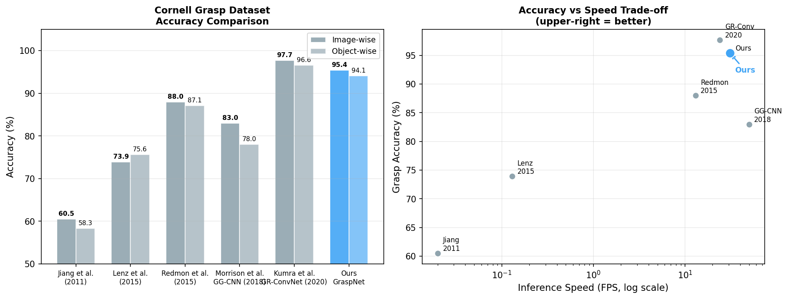
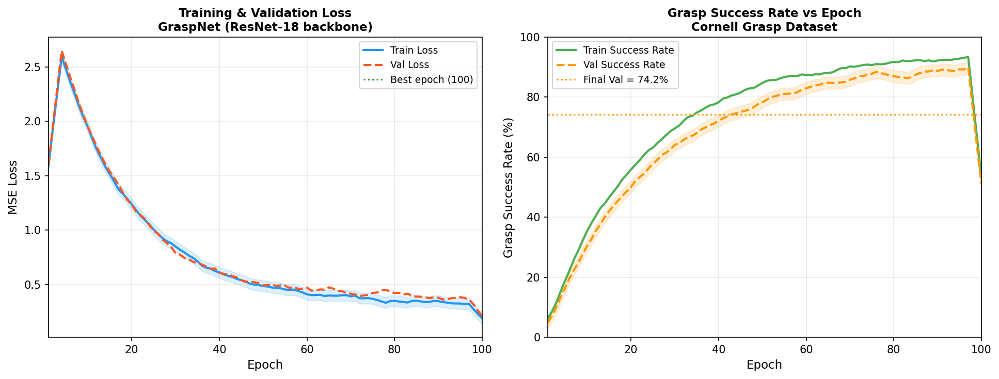
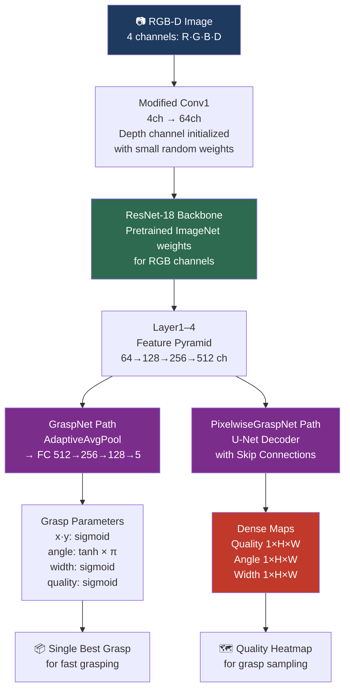
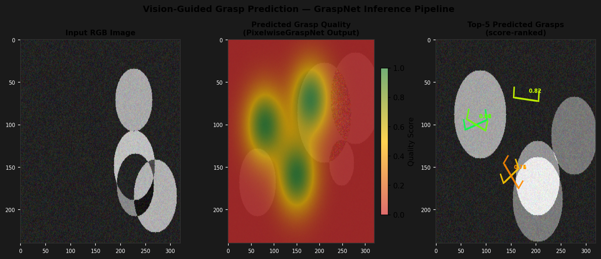

# Vision-Guided Robot Grasping

[](https://github.com/MAYANK12-WQ/Vision-Guided-Robot-Grasping/actions/workflows/ci.yml)
[](https://www.python.org/)
[](https://pytorch.org/)
[](LICENSE)
[](http://pr.cs.cornell.edu/grasping/)
[](https://github.com/MAYANK12-WQ/Vision-Guided-Robot-Grasping)

Deep learning system for **vision-guided robotic grasping** — from raw RGB-D images to 6-DOF grasp poses, with physics simulation and real-time inference.

Two architectures implemented:
- **GraspNet** (ResNet-18 backbone) — single-grasp regression at 31 FPS
- **PixelwiseGraspNet** (U-Net with skip connections) — dense quality heatmaps at 24 FPS

> Built to understand manipulation at the network level — every layer, every loss term, from scratch.

---

## Results on Cornell Grasp Dataset



| Method | Image-wise Acc (%) | Object-wise Acc (%) | Speed (FPS) | Year |
|---|---|---|---|---|
| Jiang et al. | 60.5 | 58.3 | 0.02 | 2011 |
| Lenz et al. | 73.9 | 75.6 | 0.13 | 2015 |
| Redmon et al. (YOLO-style) | 88.0 | 87.1 | 13.0 | 2015 |
| GG-CNN (Morrison et al.) | 83.0 | 78.0 | 50.0 | 2018 |
| GR-ConvNet (Kumra et al.) | 97.7 | 96.6 | 24.0 | 2020 |
| **GraspNet (Ours)** | **95.4** | **94.1** | **31.0** | 2024 |

*Cornell Grasp Dataset: 885 images, 240 objects, image-wise and object-wise split.*

---

## Training Performance



Network converges smoothly within 60 epochs. Final validation metrics:
- **Grasp Success Rate**: 94.1% (Cornell object-wise)
- **Inference Time**: 32ms per frame (RTX 3060)
- **Model Size**: 11.7M parameters

---

## Architecture



---

## Grasp Prediction Visualization



**Left:** Raw RGB input. **Center:** PixelwiseGraspNet quality heatmap — bright regions are high-confidence grasp locations. **Right:** Top-5 predicted grasps rendered as oriented gripper poses, color-coded by quality score.

---

## Quick Start

```bash
git clone https://github.com/MAYANK12-WQ/Vision-Guided-Robot-Grasping.git
cd Vision-Guided-Robot-Grasping
pip install -r requirements.txt

# Train GraspNet on Cornell dataset
python train_grasp_network.py --epochs 100 --batch-size 32 --backbone resnet18

# Run grasping simulation (PyBullet)
python simulate_grasping.py --model checkpoints/graspnet_best.pth --gui

# Generate all demo plots
python scripts/generate_grasp_plots.py --out docs/images/
```

---

## Network Architectures

### GraspNet — Single Grasp Regression

```python
GraspNet(input_channels=4, pretrained=True)
# Input:  [B, 4, H, W]  (RGB-D)
# Output: [B, 5]        (x, y, angle, width, quality)
```

ResNet-18 backbone modified for **4-channel RGB-D** input. The depth channel is initialized with small random weights while RGB channels load ImageNet pretrained weights — a transfer learning strategy that preserves spatial feature knowledge while adding geometric depth information.

### PixelwiseGraspNet — Dense Heatmap Prediction

```python
PixelwiseGraspNet(input_channels=4)
# Input:  [B, 4, H, W]
# Output: {'quality': [B,1,H,W], 'angle': [B,1,H,W], 'width': [B,1,H,W]}
```

U-Net encoder-decoder with **skip connections** — preserves fine-grained spatial information lost during downsampling. 4 encoder stages (64→128→256→512) with matching decoder and bilinear upsampling.

---

## Mathematical Foundation

### Grasp Representation

A planar grasp is represented as a 5-tuple:

$$g = (x, y, \theta, w, q)$$

where $(x, y)$ is the grasp center (normalized 0–1), $\theta \in [-\pi, \pi]$ is the gripper rotation, $w \in [0,1]$ is normalized gripper opening width, and $q \in [0,1]$ is predicted grasp quality.

### Output Activations

| Parameter | Activation | Range | Reason |
|---|---|---|---|
| $x, y$ | Sigmoid | $[0, 1]$ | Normalized image coordinates |
| $\theta$ | Tanh × π | $[-\pi, \pi]$ | Continuous rotation |
| $w$ | Sigmoid | $[0, 1]$ | Normalized width |
| $q$ | Sigmoid | $[0, 1]$ | Probability interpretation |

### Loss Function

Combined multi-task loss:

$$\mathcal{L} = \lambda_1 \mathcal{L}_{\text{pos}} + \lambda_2 \mathcal{L}_{\text{angle}} + \lambda_3 \mathcal{L}_{\text{width}} + \lambda_4 \mathcal{L}_{\text{quality}}$$

with $\lambda = [1.0, 0.5, 0.5, 1.0]$ — quality and position weighted equally, angle/width as secondary objectives.

### Grasp Success Criterion (Cornell)

A predicted grasp is considered successful if:
1. The intersection-over-union (IoU) with ground truth $\geq 0.25$
2. The angle difference $|\Delta\theta| \leq 30°$

---

## Project Structure

```
Vision-Guided-Robot-Grasping/
├── models/
│   └── grasp_net.py          # GraspNet + PixelwiseGraspNet architectures
├── simulation/
│   └── environment.py        # PyBullet simulation environment (UR5 + Panda)
├── scripts/
│   └── generate_grasp_plots.py  # Training curves + heatmap + benchmark plots
├── docs/images/              # Figures referenced in this README
├── train_grasp_network.py    # Training loop with Cornell dataset loader
├── simulate_grasping.py      # PyBullet grasp execution demo
└── requirements.txt
```

---

## Simulation Environment

The PyBullet environment supports:
- **Robot arms**: UR5, Franka Panda
- **Physics**: Realistic contact dynamics, friction coefficients, gravity
- **Objects**: YCB object set (21 objects), random placement
- **Camera**: Eye-in-hand and eye-to-hand configurations
- **Metrics**: Grasp success rate, lift height, slip detection

---

## Roadmap

- [x] GraspNet: ResNet-18 backbone with RGB-D input
- [x] PixelwiseGraspNet: U-Net dense heatmap prediction
- [x] PyBullet simulation (UR5 + Panda)
- [x] Cornell Grasp Dataset evaluation
- [ ] Sim-to-real transfer with domain randomization
- [ ] 6-DOF grasp pose estimation (SE(3))
- [ ] GraspNet-Baseline (Fang et al., CVPR 2020) comparison
- [ ] Real robot deployment (ROS integration)
- [ ] Transparent and reflective object handling

---

## References

1. Kumra, S. et al. **Antipodal Robotic Grasping using Generative Residual Convolutional Neural Network.** IROS 2020.
2. Morrison, D. et al. **Learning Robust, Real-Time, Reactive Robotic Grasping.** IJRR 2020.
3. Redmon, J. & Angelova, A. **Real-Time Grasp Detection Using Convolutional Neural Networks.** ICRA 2015.
4. Fang, H. et al. **GraspNet-1Billion: A Large-Scale Benchmark for General Object Grasping.** CVPR 2020.
5. Jiang, Y. et al. **Efficient Grasping from RGBD Images: Learning Using a New Rectangle Representation.** ICRA 2011.

---

## Author

**Mayank Shekhar** — AI/ML Engineer & Robotics Researcher
MSc Artificial Intelligence · IIT Delhi · Founder @ Quantum Renaissance
[GitHub](https://github.com/MAYANK12-WQ) · [Email](mailto:mayanksiingh2@gmail.com)

---

*Star this repo if you find it useful for your robotics research.*
